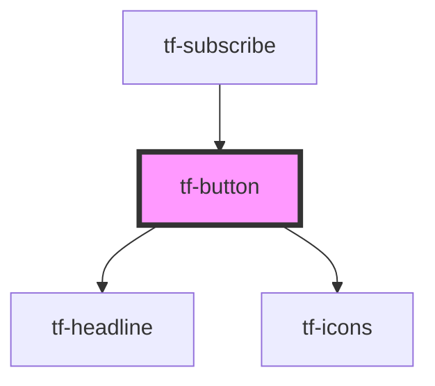

# tf-button

<!-- Auto Generated Below -->

## Properties

| Property       | Attribute       | Description | Type      | Default       |
| -------------- | --------------- | ----------- | --------- | ------------- |
| `bold`         | `bold`          |             | `boolean` | `false`       |
| `color`        | `color`         |             | `string`  | `undefined`   |
| `disabled`     | `disabled`      |             | `boolean` | `false`       |
| `icon`         | `icon`          |             | `string`  | `undefined`   |
| `iconDisabled` | `icon-disabled` |             | `string`  | `undefined`   |
| `iconHover`    | `icon-hover`    |             | `string`  | `undefined`   |
| `shadow`       | `shadow`        |             | `boolean` | `false`       |
| `size`         | `size`          |             | `string`  | `undefined`   |
| `text`         | `text`          |             | `string`  | `undefined`   |
| `variant`      | `variant`       |             | `string`  | `'contained'` |
| `width`        | `width`         |             | `string`  | `undefined`   |

## Dependencies

### Used by

 - [tf-subscribe](../tf-subscribe)

### Depends on

- [tf-headline](../tf-headline)
- [tf-icons](../tf-icons)

### Graph

----------------------------------------------

*Built with [StencilJS](https://stenciljs.com/)*
