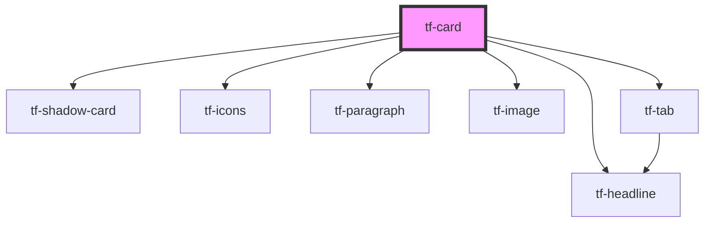

# tf-card

<!-- Auto Generated Below -->

## Properties

| Property    | Attribute  | Description | Type       | Default     |
| ----------- | ---------- | ----------- | ---------- | ----------- |
| `cost`      | `cost`     |             | `string`   | `undefined` |
| `date`      | `date`     |             | `string`   | `undefined` |
| `icon`      | `icon`     |             | `string`   | `undefined` |
| `image`     | `image`    |             | `string`   | `undefined` |
| `position`  | `position` |             | `string`   | `undefined` |
| `solution`  | `solution` |             | `boolean`  | `false`     |
| `solutions` | --         |             | `string[]` | `undefined` |
| `subtitle`  | `subtitle` |             | `string`   | `undefined` |
| `title`     | `title`    |             | `string`   | `undefined` |
| `variant`   | `variant`  |             | `string`   | `undefined` |
| `view`      | `view`     |             | `string`   | `undefined` |
| `width`     | `width`    |             | `string`   | `undefined` |

## Dependencies

### Depends on

- [tf-shadow-card](../tf-shadow-card)
- [tf-icons](../tf-icons)
- [tf-headline](../tf-headline)
- [tf-paragraph](../tf-paragraph)
- [tf-image](../tf-image)
- [tf-tab](../tf-tab)

### Graph

----------------------------------------------

*Built with [StencilJS](https://stenciljs.com/)*
