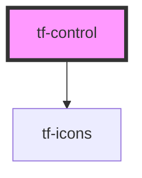

# tf-control

<!-- Auto Generated Below -->

## Properties

| Property    | Attribute   | Description | Type      | Default     |
| ----------- | ----------- | ----------- | --------- | ----------- |
| `direction` | `direction` |             | `string`  | `undefined` |
| `disabled`  | `disabled`  |             | `boolean` | `false`     |
| `variant`   | `variant`   |             | `string`  | `'desktop'` |

## Dependencies

### Depends on

- [tf-icons](../tf-icons)

### Graph

----------------------------------------------

*Built with [StencilJS](https://stenciljs.com/)*
