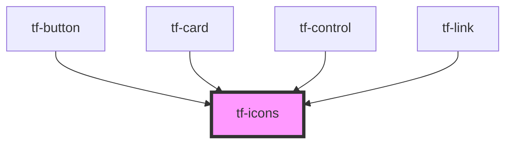

# tf-icons

<!-- Auto Generated Below -->

## Properties

| Property   | Attribute   | Description | Type      | Default     |
| ---------- | ----------- | ----------- | --------- | ----------- |
| `iconName` | `icon-name` |             | `string`  | `undefined` |
| `pointer`  | `pointer`   |             | `boolean` | `undefined` |

## Dependencies

### Used by

 - [tf-button](../tf-button)
 - [tf-card](../tf-card)
 - [tf-control](../tf-control)
 - [tf-link](../tf-link)

### Graph

----------------------------------------------

*Built with [StencilJS](https://stenciljs.com/)*
