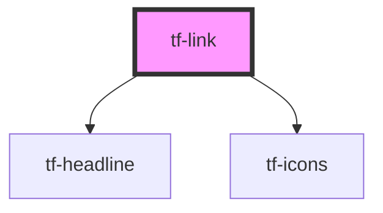

# tf-link

<!-- Auto Generated Below -->

## Properties

| Property   | Attribute  | Description | Type      | Default     |
| ---------- | ---------- | ----------- | --------- | ----------- |
| `active`   | `active`   |             | `boolean` | `false`     |
| `disabled` | `disabled` |             | `boolean` | `false`     |
| `href`     | `href`     |             | `string`  | `undefined` |
| `target`   | `target`   |             | `string`  | `undefined` |
| `text`     | `text`     |             | `string`  | `undefined` |
| `variant`  | `variant`  |             | `string`  | `undefined` |

## Dependencies

### Depends on

- [tf-headline](../tf-headline)
- [tf-icons](../tf-icons)

### Graph

----------------------------------------------

*Built with [StencilJS](https://stenciljs.com/)*
