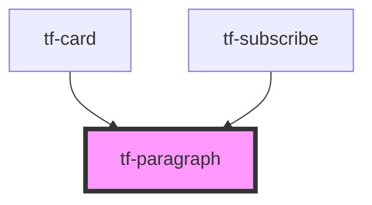

# tf-paragraph

<!-- Auto Generated Below -->

## Properties

| Property    | Attribute   | Description | Type     | Default     |
| ----------- | ----------- | ----------- | -------- | ----------- |
| `color`     | `color`     |             | `string` | `undefined` |
| `component` | `component` |             | `string` | `undefined` |
| `variant`   | `variant`   |             | `string` | `undefined` |

## Dependencies

### Used by

 - [tf-card](../tf-card)
 - [tf-subscribe](../tf-subscribe)

### Graph

----------------------------------------------

*Built with [StencilJS](https://stenciljs.com/)*
