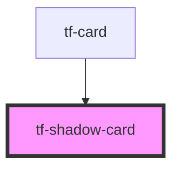

# tf-shadow-card

<!-- Auto Generated Below -->

## Properties

| Property  | Attribute | Description | Type     | Default |
| --------- | --------- | ----------- | -------- | ------- |
| `variant` | `variant` |             | `string` | `'sh1'` |

## Dependencies

### Used by

 - [tf-card](../tf-card)

### Graph

----------------------------------------------

*Built with [StencilJS](https://stenciljs.com/)*
