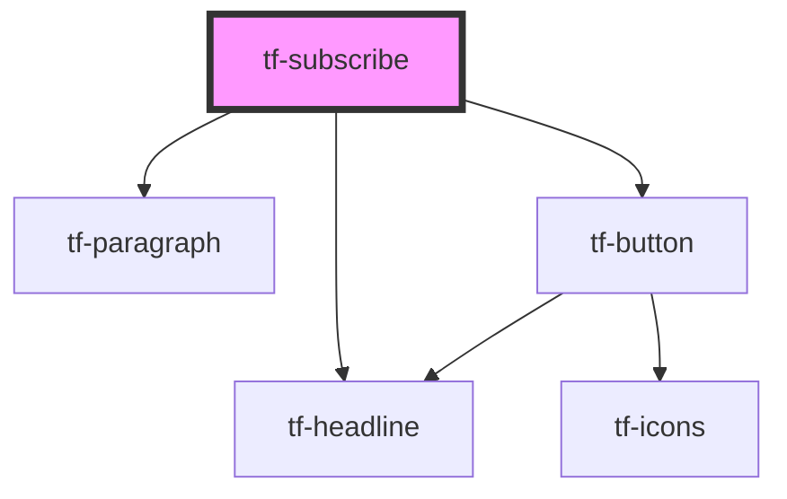

# tf-subscribe

<!-- Auto Generated Below -->

## Properties

| Property  | Attribute | Description | Type     | Default     |
| --------- | --------- | ----------- | -------- | ----------- |
| `theme`   | `theme`   |             | `string` | `undefined` |
| `variant` | `variant` |             | `string` | `undefined` |

## Dependencies

### Depends on

- [tf-headline](../tf-headline)
- [tf-paragraph](../tf-paragraph)
- [tf-button](../tf-button)

### Graph

----------------------------------------------

*Built with [StencilJS](https://stenciljs.com/)*
