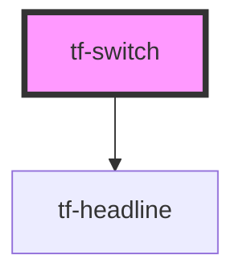

# tf-switch

<!-- Auto Generated Below -->

## Properties

| Property  | Attribute | Description | Type     | Default     |
| --------- | --------- | ----------- | -------- | ----------- |
| `variant` | `variant` |             | `string` | `'desktop'` |

## Dependencies

### Depends on

- [tf-headline](../tf-headline)

### Graph

----------------------------------------------

*Built with [StencilJS](https://stenciljs.com/)*
