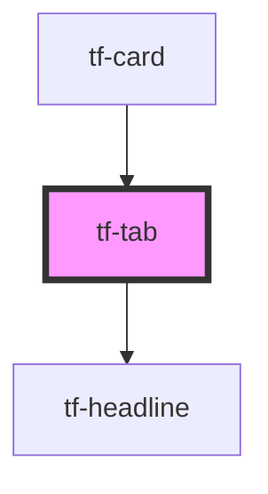

# tf-tab

<!-- Auto Generated Below -->

## Properties

| Property  | Attribute | Description | Type     | Default   |
| --------- | --------- | ----------- | -------- | --------- |
| `variant` | `variant` |             | `string` | `'small'` |

## Dependencies

### Used by

 - [tf-card](../tf-card)

### Depends on

- [tf-headline](../tf-headline)

### Graph

----------------------------------------------

*Built with [StencilJS](https://stenciljs.com/)*
